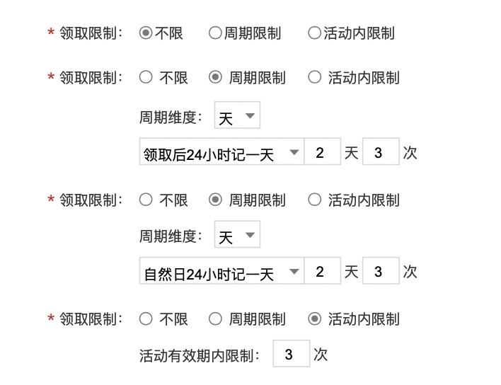
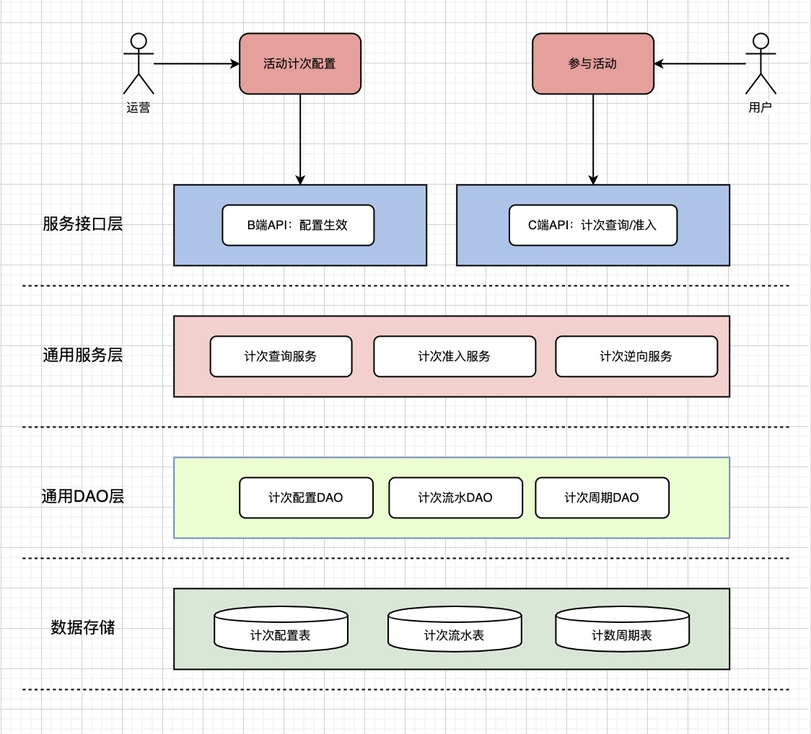
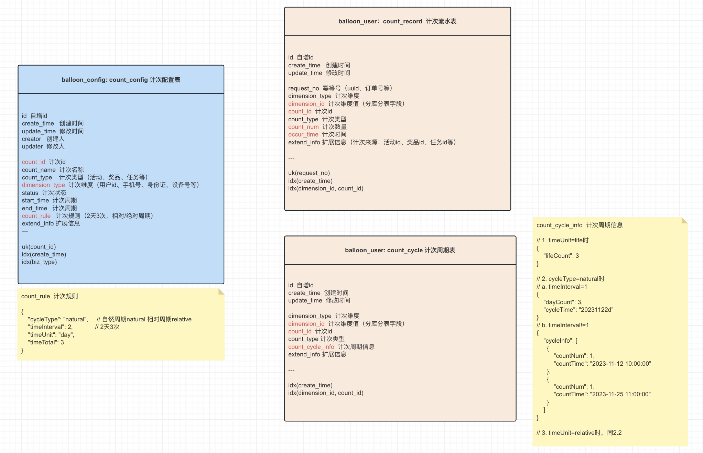
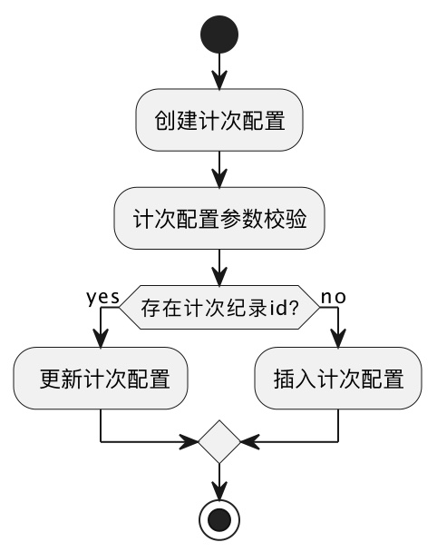
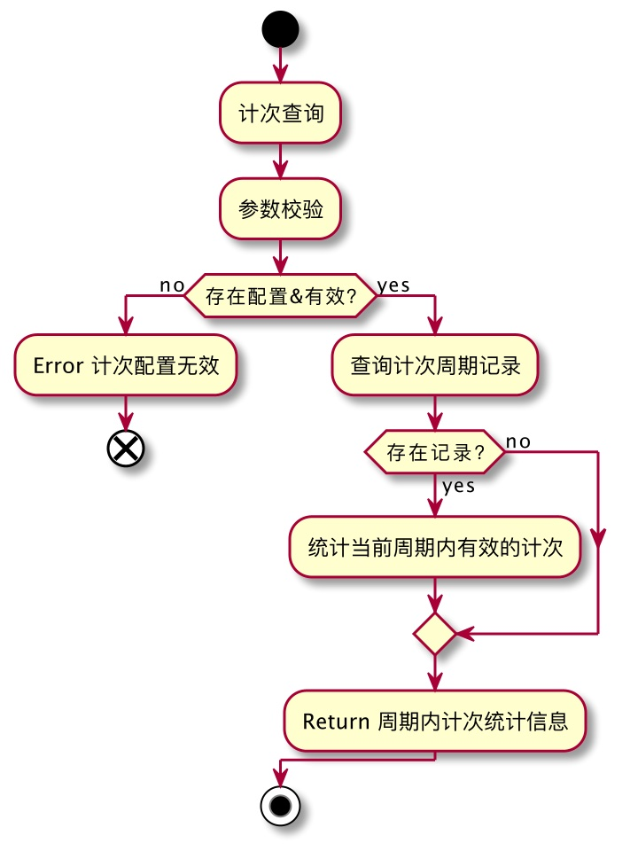
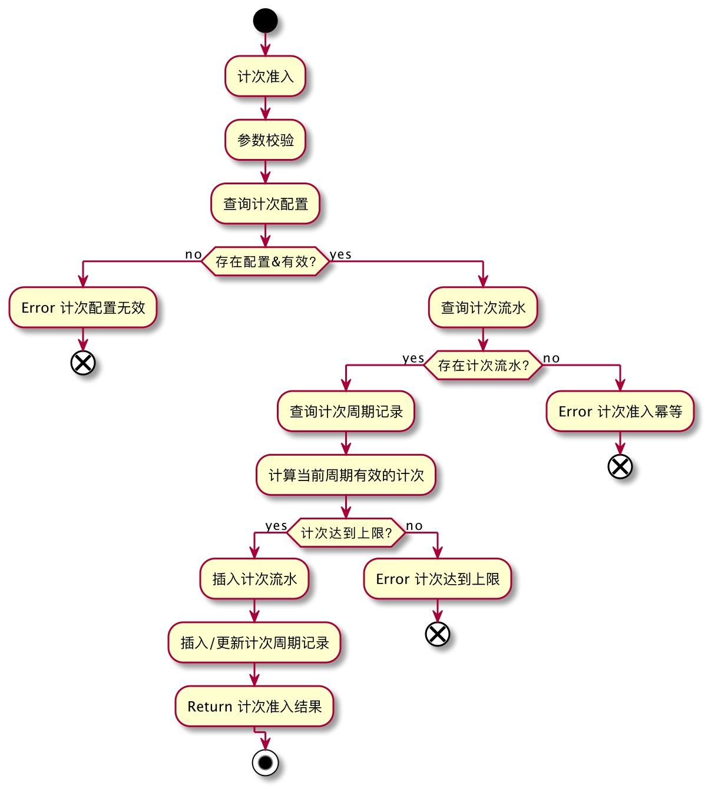
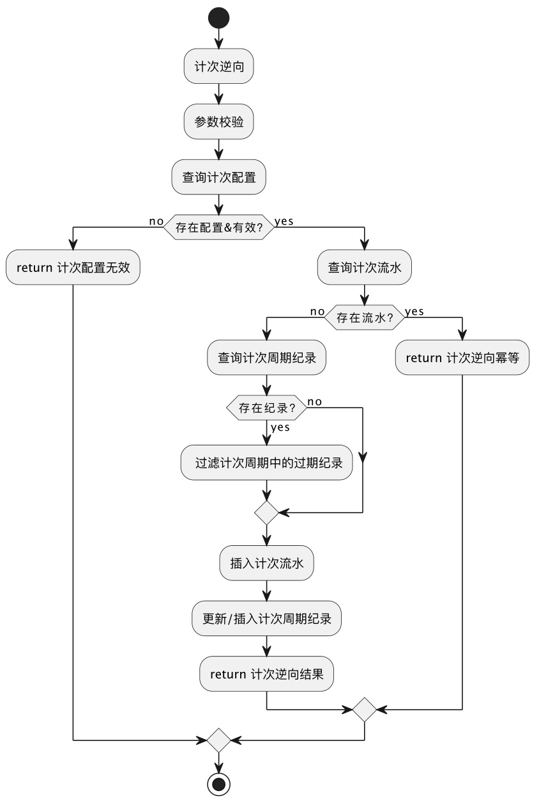

# count-service 计次服务
提供通用的计次能力，支持活动、奖品、任务等。


## 一、目标
计次服务支持多维度（用户id/手机号/身份证号/设备号等）、多周期（相对/绝对周期、2天3次/每周1次等）的计次能力。

以活动领取限制举例，原型设计如下：


## 二、整体架构


## 三、存储设计
count_config 计次配置表：主要存储计次id和计次规则；
count_record 计次流水表：用于存储计次流水，和做幂等判断；
count_cycle 计次周期表：是用户在某计次下流水的汇总，用于计次查询和准入的判断；

其中，count_record表和count_cycle表以dimension_id字段进行分库分表，来满足大数据量的存储。

Refer：https://www.processon.com/v/6571657440125a40fd13310b


## 四、流程设计
计次服务包括的核心功能：创建计次配置、计次查询、计次准入和计次逆向。
### 1. 创建计次配置

### 2. 计次查询

### 3. 计次准入

### 4. 计次逆向



## 五、接口定义
```    
B侧接口：CountConfigApi
1. 生成计次配置id
    Result<String> generateCountId(String countType);
2. 创建计次配置
    Result<String> createCountConfig(CountConfigParam param);
3. 查询计次配置
    Result<CountConfigDto> queryCountConfig(String countId);
    
C侧接口：CountServiceApi 
1. 计次查询
    Result<CountCheckDto> checkCount(CountCheckParam param);
2. 计次准入
    Result<CountResultDto> insertCount(CountInsertParam param);
3. 计次逆向
    Result<CountResultDto> rollbackCount(CountRollbackParam param);
4. 用户计次纪录查询
    Result<CountUserRecordDto> queryUserCountRecord(CountUserRecordParam param);
```

## 六、压力测试
todo

## 七、快速开始

分库分表： count-config实例、count_user实例（十库十表）

toB ✈️
- count-api/app分层设计 done
- 生成数据库实体类和mapper done
- B侧api定义 done
- 生成计次配置id done
- repository语义转换 done
- count_config数据源配置 done
- 创建计次实现 done
- B侧api功能自测 done

toC ✈️
- c侧api定义
- c侧api实现
- sharding分库分表
- repository语义转换
- 计次查询
- 计次准入
- 计次逆向
- 查询用户计次纪录
- c侧功能自测
- 压力测试


